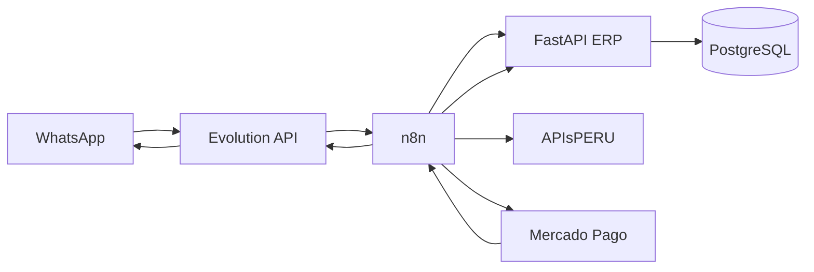

# V1N — Gestión financiera automatizada

## Arquitectura

El ERP y PostgreSQL son la fuente financiera canónica. Mercado Pago es la autoridad externa del pago; n8n solo orquesta; Evolution API es el canal; APIsPERU solo apoya una validación documental explícita. Ningún webhook modifica directamente un saldo.

## Inventario único del 16 de agosto de 2026

| Área | Estado | Hallazgo |
|---|---|---|
| Conceptos, pensiones y pagos | YA EXISTE | `conceptos_pago`, `pensiones` y `pagos` son las entidades canónicas. |
| Estado de cuenta y saldo derivado | PARCIAL | Había reportes, pero no aplicaciones de pago ni saldo derivado. |
| Intentos, inbox e idempotencia externa | FALTA | Se incorporan en `finanzas_integraciones_v1n`. |
| Apoderados y teléfono | YA EXISTE | Se reutilizan `apoderados` y `estudiante_apoderado`; se prioriza relación principal. |
| Auditoría | PARCIAL | Existe middleware; V1N añade `source=INTEGRACION`, provider, correlación e inbox. |
| Frontend `/finanzas` | PARCIAL | Existía una pantalla con mocks/contratos legacy; V1N la conecta a contratos canónicos. |
| n8n | YA EXISTE | Servicio activo; el único workflow previo es académico y no se modifica. |
| Evolution API / WPPConnect | FALTA | Ninguno está desplegado; no se instala uno automáticamente ni se inventa una sesión. |
| Mercado Pago / APIsPERU | FALTA | No hay variables o credenciales activas detectables. |

## Flujo y límites de confianza

1. El webhook WhatsApp de n8n usa autenticación de cabecera configurada como credencial.
2. El teléfono se resuelve en el ERP contra el apoderado y sus estudiantes. Si hay más de uno, se devuelve selector; el workflow no elige arbitrariamente.
3. `SALDO`, `DEUDA`, `PAGAR` y `ESTADO DE CUENTA` son las únicas intenciones V1.
4. n8n consulta el estado de cuenta del ERP. Para pagar, elige una obligación pendiente real y el ERP fija el monto exacto del saldo.
5. El ERP crea `intentos_cobro` y una referencia única `ERP-{tenant}-{obligacion}-{uuid}`. El tenant nunca llega como autoridad libre.
6. n8n crea una preferencia Checkout Pro TEST y persiste `preference_id` e `init_point` en el intento.
7. Mercado Pago llama a n8n, que preserva `x-signature`, `x-request-id`, `data.id` y el body al endpoint público del ERP.
8. FastAPI valida HMAC-SHA256 con comparación constante y tolerancia antireplay, guarda un inbox sanitizado y consulta `GET /v1/payments/{id}`.
9. Solo `approved`, `PEN`, referencia existente y monto exactamente igual al intento y al saldo actual entran a la transacción canónica.
10. La transacción bloquea el intento, crea/obtiene el pago idempotente, crea `aplicaciones_pago`, deriva el saldo y actualiza el estado de la obligación. Sobrepago, monto menor o moneda distinta quedan para revisión sin aplicación.
11. WhatsApp se envía después del commit. Un fallo de mensajería deja `CONFIRMACION_WHATSAPP_PENDIENTE`; nunca revierte el pago.

La firma vigente sigue el manifiesto de la [documentación oficial de webhooks de Mercado Pago](https://www.mercadopago.com.pe/developers/es/docs/checkout-pro/payment-notifications): `id:{data.id};request-id:{x-request-id};ts:{ts};` y HMAC-SHA256 con `MERCADOPAGO_WEBHOOK_SECRET`.

## Contratos ERP

- `GET /finanzas/estudiantes/{id}/estado-cuenta`: cuenta tenant-safe; ADMIN/DIRECTOR o el mismo estudiante.
- `GET /finanzas/mi-estado-cuenta`: lectura exclusiva del estudiante autenticado.
- `GET /finanzas/obligaciones`: obligaciones y saldos derivados.
- `POST /finanzas/intentos-cobro`: crea intento por obligación, nunca por monto libre.
- `PATCH /finanzas/intentos-cobro/{id}/preferencia`: credencial interna; persiste el link.
- `GET /finanzas/intentos-cobro`: administración.
- `GET /finanzas/pagos`: pagos canónicos, sin secretos.
- `GET /finanzas/integraciones/estado`: ADMIN/DIRECTOR; solo estados de configuración.
- `GET /finanzas/integraciones/whatsapp/resolver`: credencial interna; resuelve teléfono sin tenant libre.
- `POST /integraciones/mercadopago/webhook`: público, pero exige firma Mercado Pago válida.
- `POST /finanzas/integraciones/mercadopago/confirmar`: credencial interna y segunda consulta a Mercado Pago.

## Migración

`finanzas_integraciones_v1n` depende de `apoderados_comunicacion_v1mf`. Agrega:

- `intentos_cobro`;
- `integracion_webhook_eventos`;
- `aplicaciones_pago`;
- `integraciones_tenant`;
- metadata externa y restricción `UNIQUE (tenant_id, provider, external_payment_id)` en `pagos`.

Los pagos históricos se enlazan a estudiante y se convierten en aplicaciones hasta el monto original. A partir de V1N, el pago manual también crea una aplicación dentro de la misma transacción.

## Configuración segura

Usar `.env.v1n.example` únicamente como catálogo. Los valores viven en variables del runtime o credenciales de n8n; nunca en JSON, frontend, query strings o nodos Code. `ERP_INTEGRATION_TOKEN` protege los contratos internos. La UI solo recibe estados de configuración.

Los exports referencian credenciales por nombre y marcador, sin material secreto:

- `V1N WhatsApp Webhook`;
- `V1N ERP Integration` (`X-ERP-Integration-Token`);
- `V1N Mercado Pago TEST` (`Authorization: Bearer ...`);
- `V1N Evolution API` (`apikey`).

No activar los workflows hasta completar esas credenciales, configurar URLs HTTPS y confirmar que la cuenta TEST de Mercado Pago admite `PEN`.

## Prueba E2E controlada

Datos objetivo: `ESTUDIANTE_ID=2`, un concepto V1N TEST, una obligación pendiente exacta y un apoderado principal con teléfono de prueba. El entorno inspeccionado tiene el estudiante y el vínculo principal, pero no tiene obligación ni teléfono, por lo que no debe improvisarse un destinatario.

1. Configurar credenciales TEST y un número controlado.
2. Importar ambos JSON en n8n, asignar sus cuatro credenciales y mantenerlos inactivos hasta revisar las URLs.
3. Crear una única obligación TEST para el estudiante 2 desde la API financiera.
4. Activar `V1N - WhatsApp Cobros` y `V1N - Mercado Pago Confirmación`.
5. Enviar `quiero pagar`, abrir exclusivamente `sandbox_init_point` y efectuar un pago TEST.
6. Verificar una fila de inbox, un pago `MERCADO_PAGO`, una aplicación, saldo cero y confirmación.
7. Repetir el mismo webhook firmado: debe responder 200 sin nueva fila financiera.

No se permite usar credenciales live ni realizar cobros reales durante V1N.
